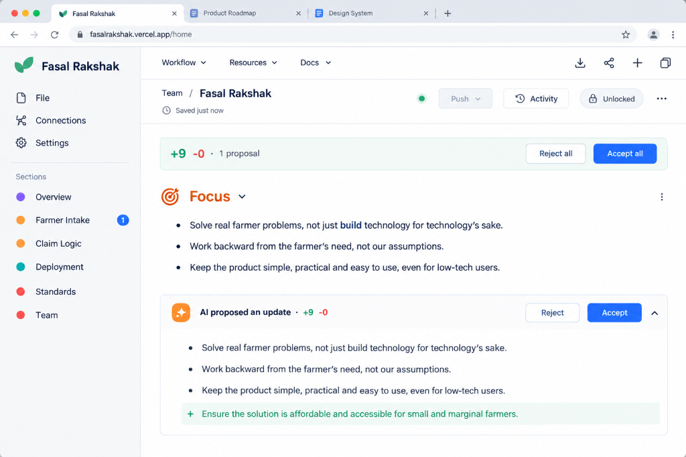

<div align="center">
  

  # 🌾 Fasal Rakshak (फसल रक्षक)
  
  **Your AI Agent for Crop Insurance Claims**
  
  <p align="center">
    Built for the <b>AWS India Builder Tour Hackathon 2026</b>
  </p>

  <p align="center">
    
    
    
    
  </p>
</div>

---

## 🚨 The Problem
Every year, thousands of Indian farmers lose their rightful **PMFBY (Pradhan Mantri Fasal Bima Yojana)** crop insurance claims due to bureaucratic friction:
- **40%** miss the strict 72-hour reporting window.
- **25%** face auto-rejections due to simple Aadhaar-to-bank spelling mismatches.
- **₹15.4K Cr** is currently pending in endless administrative backlogs.

## 💡 The Solution
**Fasal Rakshak** replaces this friction with an intelligent, multimodal AI agent that guides farmers through the claim process in their native language, validates everything in real-time, and ensures foolproof submission.

### ✨ Key Features
- 🎙️ **Voice-First Intake (Hindi & Dialects):** Farmers describe damage naturally via voice. Groq Whisper instantly structures it into PMFBY forms.
- 📸 **Vision AI Assessment:** Farmers upload a photo of their field. Multimodal AI identifies the crop, detects the disease/damage type, and estimates severity instantly.
- 🛡️ **Automated Compliance:** Validates Aadhaar & bank details in real-time to prevent unappealable hard rejections.
- ⏳ **72-Hour Safeguard:** Immutable AWS DynamoDB timestamps prove the claim was initiated within the legal window.
- ⚖️ **One-Click Legal Appeals:** Instantly generates a legally robust grievance letter citing exact PMFBY clauses if an insurance company wrongfully rejects a claim.

---

## 🏗️ Architecture & Tech Stack

Fasal Rakshak is engineered for maximum reliability and speed, combining the global scale of AWS with the real-time inference speed of Groq LPUs.

### **Frontend**
- **Next.js (App Router):** Fast, SEO-optimized, React 19 architecture.
- **Tailwind CSS & Framer Motion:** Fluid, Aceternity-inspired "Productized Agency" UI.
- **Lucide Icons:** Clean, consistent iconography.

### **Backend & AI**
- **Groq API:**
  - *Text & Reasoning:* `openai/gpt-oss-120b`
  - *Vision Assessment:* `qwen/qwen3.8-27b`
  - *Voice-to-Text:* `whisper-large-v3`
- **Amazon DynamoDB:** NoSQL database for ultra-fast, highly-available claim and policy storage.
- **Amazon S3:** Immutable, timestamped photo evidence storage.
- **AWS Amplify:** Global edge hosting and seamless CI/CD deployments.

---

## 🚀 Getting Started (Local Development)

### Prerequisites
- Node.js 18+ and `pnpm`
- AWS Account (for DynamoDB and S3)
- Groq API Key

### 1. Clone & Install
```bash
git clone https://github.com/yourusername/fasal-rakshak.git
cd fasal-rakshak
pnpm install
```

### 2. Environment Variables
Create a `.env.local` file in the root directory and add the following:
```env
# AWS Configuration (Prefixed with MY_ to bypass Amplify reserved vars)
MY_AWS_ACCESS_KEY_ID=your_aws_access_key
MY_AWS_SECRET_ACCESS_KEY=your_aws_secret_key
MY_AWS_REGION=ap-south-1

# Groq AI Keys
GROQ_API_KEY=your_groq_api_key
GROQ_MODEL_ID_TEXT=openai/gpt-oss-120b
GROQ_MODEL_ID_VISION=qwen/qwen3.8-27b

# DynamoDB Tables
DYNAMODB_TABLE_CLAIMS=fasal-rakshak-claims-farmer
DYNAMODB_TABLE_POLICIES=fasal-rakshak-policies-farmer

# Test Mode (For Hackathon Demos)
ENABLE_TEST_MODE=true
```

### 3. Run the Development Server
```bash
pnpm run dev
```
Open [http://localhost:3000](http://localhost:3000) in your browser to see the app.

---

## 🎭 Demo Mode
For live presentations, the app includes a seamless demo bypass:
- Entering `TEST-POLICY-001` on the report page will automatically inject a mock farmer profile, bypassing the need for a live DynamoDB policy match.
- The 72-hour countdown timer artificially caps at 02:15:00 if expired, ensuring a dramatic (but not broken) presentation UI.

---

<div align="center">
  <i>Empowering farmers with the technology they deserve.</i>
</div>
